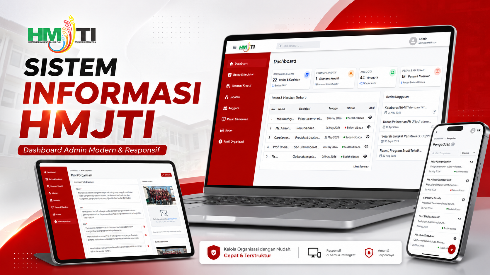

# HMJ TI Admin

Admin dashboard for managing HMJ TI UINAM website content. This React application provides authenticated tools for administrators to manage organizational data, public website content, complaints, cadres, and dashboard summaries through the HMJ TI backend API.

## Description

HMJ TI Admin is the internal management dashboard for Himpunan Mahasiswa Jurusan Teknik Informatika UIN Alauddin Makassar. It helps administrators maintain articles, creative economy products, organizational positions, members, cadres, complaints, and organization profile data that are displayed through the public HMJ TI website.

The application consumes the HMJ TI backend API through a shared Axios client in `src/config/api.js`. The API client reads the backend URL from Vite environment variables and automatically attaches the stored bearer token for authenticated requests.

The main goal of this project is to provide an efficient, structured, and secure admin interface that helps HMJ-TI UINAM manage organizational content and public-facing data more easily.



## Features

- Admin login and logout with token-based authentication.
- Protected dashboard routes and guest-only login route.
- Dashboard summary cards for articles, businesses, members, cadres, and complaints.
- Recent complaint and featured article overview on the dashboard.
- CRUD management for articles, businesses, positions, members, and cadres.
- Organization profile management for goals, vision, missions, and profile images.
- Complaint management with read/unread status, detail view, deletion, and bulk deletion.
- Search, filters, pagination, reusable table components, and bulk selection actions.
- Rich text editor support for article content.
- File upload support for images through FilePond.
- Global API error handling, snackbar notifications, and automatic redirect on unauthorized responses.

## Tech Stack

- React 18
- Vite
- React Router
- Material UI
- Emotion
- Axios
- TipTap
- FilePond
- Notistack
- React Icons
- ESLint

## Installation

Clone the repository:

```bash
git clone https://github.com/AhmadIkbalDjaya/hmj-ti-admin.git
cd hmj-ti-admin
```

Install dependencies:

```bash
npm install
```

Create the environment file:

```bash
cp .env.example .env
```

For Windows PowerShell:

```powershell
Copy-Item .env.example .env
```

## Environment Variables

This project uses Vite environment variables. Frontend variables must use the `VITE_` prefix.

| Variable | Description |
| --- | --- |
| `VITE_APP_NAME` | Application name displayed or referenced by the admin app. |
| `VITE_API_URL` | Backend application base URL. The shared API client appends `/api` in `src/config/api.js`. |

See `.env.example` for the default local values.

## Running Locally

Start the development server:

```bash
npm run dev
```

By default, the admin dashboard will be available at:

```text
http://localhost:5173
```

Run the linter:

```bash
npm run lint
```

Build the production bundle:

```bash
npm run build
```

Preview the production build locally:

```bash
npm run preview
```

## Project Structure

```text
.env.example          Example environment variables.
.vscode/              Local editor settings.
dist/                 Production build output.
docs/                 Project documentation assets.
  thumbnail.png       README thumbnail image.
public/               Static public assets.
src/
  assets/             Images, logos, icons, empty states, and background assets.
  components/         Shared UI components, layout components, inputs, tables, modals, and editor wrappers.
  config/             Shared API client configuration.
  context/            Authentication and drawer state contexts.
  helpers/            API, error, date, string, service, and table helper functions.
  hooks/              Shared hooks and module-level API hooks.
  pages/              Page modules for dashboard, login, articles, businesses, positions, members, complaints, cadres, and organization profile.
  routes/             React Router route definitions.
  services/           API service functions for backend resources.
  styles/             Shared style helpers.
  theme/              Material UI theme customizations.
  utils/              Utility helpers.
  App.jsx             Root application component.
  main.jsx            React entry point.
```

## Related Repository

- Admin dashboard: [hmj-ti-admin](https://github.com/AhmadIkbalDjaya/hmj-ti-admin)
- Public website: [hmj-ti](https://github.com/AhmadIkbalDjaya/hmj-ti)
- Backend API: [hmj-ti-be](https://github.com/AhmadIkbalDjaya/hmj-ti-be)
